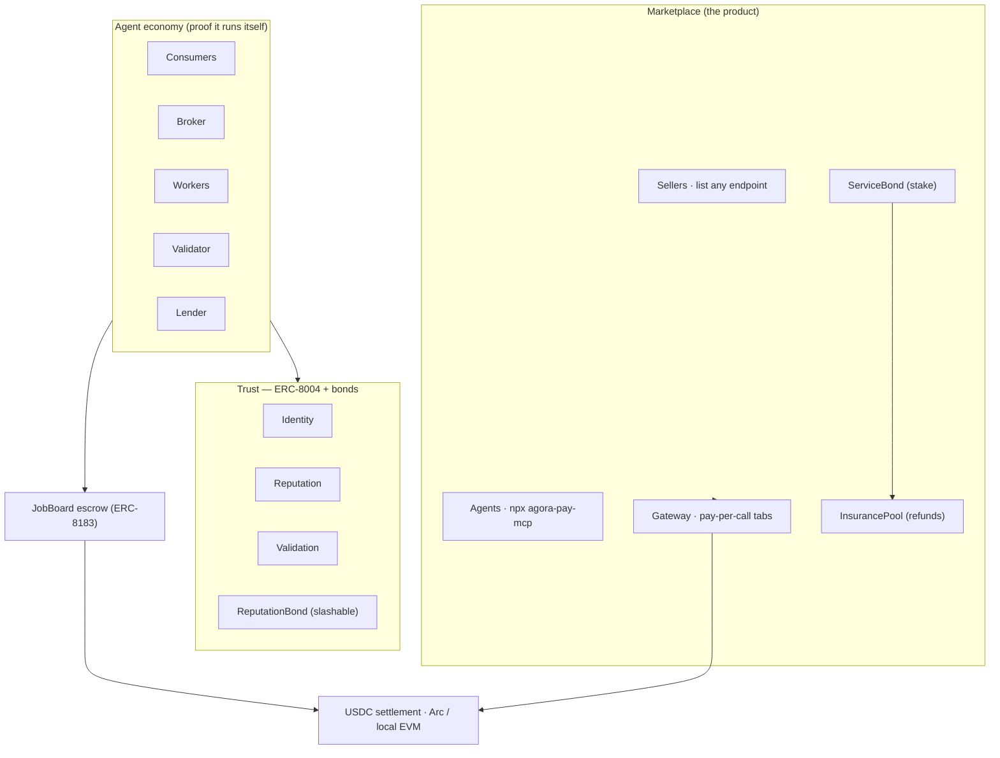

# 🏛️ Agora — payments infrastructure for AI agents

[](https://github.com/Ritik200238/agora/actions/workflows/ci.yml)
[](https://agora-j52a.onrender.com)
[](https://agora-arc.vercel.app)
[](https://www.npmjs.com/package/agora-pay-mcp)
[](./LICENSE)

**Pay $0.000001. Not $9.99/month.** Agora is the money layer for AI agents on Circle's **Arc** chain: any
agent — or developer — can **charge and pay per API call in fractions of a cent**, settled instantly in USDC.
No subscriptions, no Stripe, no KYC, no custody.

- 🔌 **One line, and your agent has a wallet.** `npx agora-pay-mcp` gives any Claude / Cursor / Codex agent a
  **budget-capped** USDC wallet and a **trust-checked marketplace** it can shop in today.
- 💸 **Real nanopayments, on real Arc.** Verified on-chain down to **$0.000001** (chain 5042002) —
  [see it on Arcscan ↗](https://testnet.arcscan.app/tx/0x29125d42028f32e6e3fd247f163b7f9cbe986a7cc01e596c3f52da48259de839).
- 🛡️ **The only marketplace with skin in the game.** Sellers stake USDC (`ServiceBond`); repeat offenders get
  **slashed** straight into an on-chain **insurance pool** that refunds the buyer they wronged — and
  schema-checked delivery means you're **never charged for junk**.
- 🏛️ **Underneath it all:** a fully autonomous **12-agent economy** that hires, prices, lends, and settles
  itself 24/7 — proof this is infrastructure, not a toy.

**▶️ [Try it live](https://agora-j52a.onrender.com/pay) · [Marketplace](https://agora-j52a.onrender.com/registry) · [Live economy](https://agora-j52a.onrender.com) · [npm](https://www.npmjs.com/package/agora-pay-mcp)**

> **Jargon, once:** **x402** = the "HTTP 402 Payment Required" pay-per-call standard · **ERC-8004** = the
> on-chain standard for AI-agent identity + reputation · **ERC-8183** = programmable job escrow · **Circle
> Gateway / Nanopayments** = gasless, batched USDC transfers down to $0.000001. Full spec: [`tdd.md`](./tdd.md).

---

## 🚪 Two doors: sell a service, or plug in an agent

**Sellers — earn per call.** List *any* HTTP endpoint in one call and get paid **directly on-chain** per
successful request — sub-cent, no Stripe / KYC / subscription. Below ~$0.30 a call, cards literally can't do
this.

```bash
URL=https://agora-j52a.onrender.com
curl -s -XPOST $URL/x402/services/register -H content-type:application/json -d '{
  "name":"My API","url":"https://my-server/endpoint","priceUsdc":0.002,
  "desc":"what it does","payTo":"0xYourWallet","exampleInput":{"text":"hi"}
}'
```

**Agents — pay per call.** Plug any Claude / Cursor / Codex agent in with **one MCP config line** — it gets a
budget-capped wallet + a trust-checked marketplace on Arc:

```json
{ "mcpServers": { "agora-pay": { "command": "npx", "args": ["-y", "agora-pay-mcp"] } } }
```

Or drive the gateway directly — open a capped **tab**, then pay per call:

```bash
curl -s -XPOST $URL/x402/tab -H content-type:application/json -d '{"capUsdc":0.1}'          # -> { tabId, ... }
curl -s -XPOST $URL/x402/tab/<tabId>/call -H content-type:application/json \
     -d '{"service":"price","input":{"asset":"bitcoin"}}'                                     # pay $0.0001 -> LIVE BTC price
```

Try it in the browser at **[/pay](https://agora-j52a.onrender.com/pay)** and **[/registry](https://agora-j52a.onrender.com/registry)**. Every third-party payin moves real `externalVolume` — the
honest counter of external usage, kept separate from the agents' internal volume.

---

## 🛡️ The moat: trust with real money behind it

Everyone else's agent-reputation is a *rating*. Agora's is **collateral**.

- **Bonded services** — a seller stakes USDC in `ServiceBond` behind their listing → a **BONDED** badge + a
  higher trust score. Real skin in the game, on-chain.
- **Never charged for junk** — sellers declare the fields they promise to return; a 200 carrying empty or
  invalid output isn't a valid delivery, so the buyer is **not charged**.
- **Slash → insurance** — a service that keeps failing is **slashed**, and the seized stake flows into an
  on-chain **buyer-protection pool** (`InsurancePool`). An upheld dispute **refunds the wronged buyer from that
  pool** and slashes the seller to replenish it.

> **The only agent marketplace where a bad actor loses money — and the buyer doesn't.** Circle's own stack
> ships identity, payments, and a marketplace, but leaves trust + insurance open. This is that lane.

## 🧰 Real, useful services (no API keys, real data)

The house sells genuinely useful pay-per-call services, and anyone can list more:

| Service | Price | What it returns |
| --- | --- | --- |
| `price` | $0.0001 | Live crypto price — real CoinGecko market data |
| `fx` | $0.0001 | Live currency conversion — real FX rates |
| `weather` | $0.0002 | Current weather for any city — real Open-Meteo data |
| `email` | $0.0002 | Email deliverability via a real DNS MX lookup |
| `trust` | $0.001 | **Agent Trust Oracle** — on-chain reputation + bond + a TRUSTED / AVOID verdict before you deal |
| `feed` | $0.000001 | One reading from the economy's live data feed (the headline nanopayment) |

Plus a drop-in **[`agora-paywall`](./paywall/README.md)** package: put a per-request USDC paywall in front of
any Express route in 3 lines.

---

## ✅ On real Arc Testnet (chain 5042002)

The contracts are **deployed to Arc** and real **tiny-USDC** pay-per-use has **settled on-chain** — a
[$0.000001 nanopayment](https://testnet.arcscan.app/tx/0x29125d42028f32e6e3fd247f163b7f9cbe986a7cc01e596c3f52da48259de839)
+ [$0.001](https://testnet.arcscan.app/tx/0x74073eee40d40e9b5fc99425e1199715305e1f1a831917df79af2574c2d3cd8f) /
[$0.0005](https://testnet.arcscan.app/tx/0x2e3b0dbd754dc33da251b903899734119fc3e9e6e4d188d25d2bf47dc6aeb9ce) calls, each verified.
Circle **Gateway / Nanopayments** also **runs on Arc** — a real gasless, batched USDC nanopayment via Circle's
facilitator (`npm run gateway:arc`). Reproduce with a faucet-funded key: `npm run deploy:arc && npm run arc:demo`.

---

## 🏛️ Underneath: an economy that proves it's infrastructure

We didn't just build a marketplace — we ran a full **12-agent economy** through it. Each tick:

1. **Consumers** post USDC-funded needs — gated by a **treasury spend-firewall**.
2. A **Broker** collects competitive **quotes** and routes each job to the best value (price × reputation) —
   price is **discovered**, not fixed; expensive jobs get priced out.
3. **Workers** deliver objective, re-executable work; a **Validator** independently **re-executes** and the
   contract derives the verdict on-chain.
4. The **JobBoard escrow** settles: pass → pay + raise reputation; fail → **refund the client, slash the
   worker's locked USDC bond, tank its reputation.**
5. A **Lender** runs a reputation-backed **credit market** — reputable workers borrow against their on-chain
   reputation and repay with interest.

**Emergent result:** prices move with supply/demand; honest workers earn *and* borrow; a fraudster is slashed
once and **frozen out**; a hijacked agent that tries to drain funds is **blocked by the firewall**. Watch it
live at **[agora-j52a.onrender.com](https://agora-j52a.onrender.com)**.



---

## 🔵 Circle / Arc primitives used

| Primitive | Where in Agora |
| --- | --- |
| **USDC** (native on Arc, 6-dp ERC-20) | every payment — pay-per-call, escrow, fees, bonds, slashes, refunds |
| **Circle Gateway / Nanopayments** | `rail/x402.ts` `arcGatewayPay()` — **RUN on Arc**: a real gasless, batched nanopayment via Circle's facilitator (`npm run gateway:arc`) |
| **x402 pay-per-call** | `dashboard/gateway.ts` + `paywall/` + `rail/x402.ts` — capped tabs & raw x402; the public pay-per-use edge, down to **$0.000001** |
| **ERC-8004 Identity / Reputation / Validation** | `contracts/IdentityRegistry.sol`, `ReputationRegistry.sol`, `ValidationRegistry.sol` — on-chain agent trust |
| **ERC-8183 job escrow** | `contracts/JobBoard.sol` — fund → submit → validate → settle/slash |
| **ServiceBond (marketplace collateral)** | `contracts/ServiceBond.sol` — sellers stake USDC; the gateway slashes bad ones |
| **InsurancePool (buyer protection)** | `contracts/InsurancePool.sol` — slashes fund it; it refunds wronged buyers |
| **Reputation-backed credit** | `contracts/LendingPool.sol` — lenders deposit USDC; workers borrow against reputation |
| **Treasury / spend policy** | `agents/treasury.ts` — fail-closed budgets + rate caps |

---

## ⚡ Quickstart

**Run it live on GitHub — zero setup:** click **[Open in Codespaces](https://codespaces.new/Ritik200238/agora)**.
It installs deps, compiles the contracts, and boots the whole thing; open the forwarded port **4000**.

Or locally:

```bash
npm install
npm run compile        # compile contracts
npm test               # 32 contract tests + 7 end-to-end suites
npm run dashboard      # boot chain + economy + marketplace + dashboard → http://localhost:4000
```

`npm run dashboard` boots a local chain, deploys the contracts, seeds the marketplace with real bonded
services, and runs the economy live. Open **http://localhost:4000** for the economy, **/registry** for the
marketplace, and **/pay** to pay per call.

Handy scripts: `npm run test:services` (real weather/FX/email), `npm run test:warranty` (the insurance flow),
`npm run gateway:arc` (Circle Gateway on Arc), `npm run deploy:arc` (deploy to Arc Testnet).

---

## 🧪 What's verified (actually run, not stubbed)

- **32 Hardhat contract tests** — escrow lifecycle, payout splits, **fraud→slash of the locked bond**,
  **marketplace bond slashing**, the **buyer-protection insurance pool**, enforced collateral, self-deal &
  owner-rug guards, soulbound passports, and the reputation **credit market**.
- **7 end-to-end suites** against a real spawned chain — the **economy** (`test/e2e.ts`), the **pay-per-use
  gateway** (`test/gateway.ts`), the **multi-tenant marketplace** (`test/registry.ts`), **seeded bonded
  services** (`test/seed.ts`), the **warranty/insurance** flow (`test/warranty.ts`), the durable **Postgres**
  store (`test/pgstore.ts`), and the agent **MCP** (`test/mcp.ts`).
- **Real Arc Testnet** — contracts deployed, tiny-USDC settled on-chain down to **$0.000001** (verified on
  Arcscan, linked above). CI runs the whole suite on every push.

*Honest note:* the fraud + hijack beats in the economy demo are injected on cue for the show, and worker
skills are assigned (not discovered) — the emergent dynamics are **pricing, credit, trust, routing, and
slashing**. The full 12-agent economy on Arc needs each agent funded from the (captcha-gated) Circle faucet;
the **local** run is fully autonomous and proves the whole system, and Arc deployment reuses the exact code.

---

## 🗺️ Repo map

```
contracts/     ERC-8004 registries, ERC-8183 JobBoard, ReputationBond, ServiceBond, InsurancePool, LendingPool, MockUSDC
dashboard/     server.ts (SSE + API) · gateway.ts (pay-per-use + marketplace + warranty) · seed.ts · pages.ts (SEO) · public/ (UI)
mcp/           agora-pay-mcp — the agent wallet MCP server (published on npm)
paywall/       agora-paywall — drop-in per-request USDC paywall middleware
rail/          settlement (ERC-20), FlowMeter (proof-of-flow), x402 boundary (local + Arc Gateway)
agents/        tasks, treasury firewall, Agent, society builder (incl. the Lender)
orchestrator/  economy.ts (jobs, price discovery, credit, streams) + run.ts (CLI)
shared/        chain clients, ABIs, USDC helpers, typed contract client, Postgres store backend
test/          32 contract tests + 7 e2e suites + chain harness
web/           the marketing landing (Vercel) · tdd.md the spec · docs/ · CLAUDE.md the build rules
```

Built with Hardhat + viem + Express. Agents are rule-based (zero API keys, zero cost) so the economy runs
deterministically and is fully testable — exactly as the [TDD](./tdd.md) intends.
