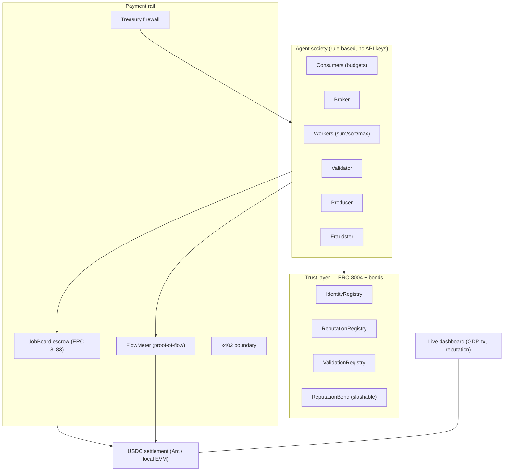

# 🏛️ Agora — the self-running agent economy on Arc

**Don't build a payments demo — boot up an economy and let it run.** Agora is a self-sustaining society
of autonomous AI agents that **hire, pay, rate, and compete** with each other 24/7, settling **USDC on Arc**.
The agents are *both supply and demand*, so the economy generates its own on-chain volume — with zero humans,
zero ad spend, and free testnet funds.

> **FlowMeter** is its payment heart · **ERC-8004** is its trust layer · **ERC-8183** escrow settles every job.
> Full product spec: [`tdd.md`](./tdd.md).

---

## What it does (in one screen)

Each tick, the economy runs itself:

1. **Consumers** post needs (USDC-funded jobs) — gated by a **treasury spend-firewall**.
2. A **Broker** routes each job to the best **reputation-gated worker** (fraudsters are excluded).
3. **Workers** deliver objective, re-executable work (honest = correct; a fraudster = tampered).
4. A **Validator** independently **re-executes** and attests on-chain.
5. The **JobBoard escrow** settles: pass → pay worker/broker/validator + raise reputation; fail → **refund
   the client, slash the worker's USDC bond, tank its reputation.**
6. A **Producer** sells a metered data feed over **FlowMeter** streams (proof-of-flow receipts, batched settle).

**Emergent result:** honest workers specialize and earn; the fraudster is slashed once and then *frozen out*;
a hijacked agent that tries to drain funds is **physically blocked by the firewall**.



---

## Circle / Arc primitives used

| Primitive | Where in Agora |
| --- | --- |
| **USDC** (native on Arc, 6-dp ERC-20) | every payment — escrow, streams, fees, bonds, slashes |
| **ERC-8004 Identity** | `contracts/IdentityRegistry.sol` — per-agent on-chain passport (ERC-721) |
| **ERC-8004 Reputation** | `contracts/ReputationRegistry.sol` — authorized-reporter on-chain track record |
| **ERC-8004 Validation** | `contracts/ValidationRegistry.sol` — request/respond attestation log |
| **ERC-8183 job escrow** | `contracts/JobBoard.sol` — fund → submit → validate → settle/slash |
| **Reputation-as-collateral** | `contracts/ReputationBond.sol` — post/withdraw/slash USDC bonds |
| **x402 service boundary** | `rail/x402.ts` — local (on-chain-verified pay-to-use) + Arc (Circle Gateway via `@circle-fin/x402-batching`) |
| **Circle Gateway / Nanopayments** | `rail/x402.ts` `arcGatewayPay()` / `arcGatewayMiddleware()` — Arc batched settlement |
| **Treasury / spend policy** | `agents/treasury.ts` — fail-closed budgets + rate caps |

---

## Quickstart

```bash
npm install
npm run compile        # compile contracts
npm test               # contract tests (11) + full end-to-end economy test
npm run dashboard      # boot chain + economy + live dashboard → http://localhost:4000
```

`npm run dashboard` boots a local chain, deploys the contracts, builds the agent society, and runs the
economy live — open **http://localhost:4000** to watch GDP tick up, the reputation leaderboard shift, the
fraudster get slashed, and the firewall block a hijack (buttons trigger those beats on demand).

Other commands:

```bash
TICKS=30 npm run economy   # run the economy headless for 30 ticks and print a final snapshot
npm run test:runtime       # runtime + payment-rail smoke test
npm run chain              # standalone local node
npm run deploy:local       # deploy onto a running local node
```

---

## What's verified (actually run, not stubbed)

- **`npm run test:contracts`** — 11 Hardhat tests: escrow lifecycle, payout splits, **fraud→slash**
  (incl. bond-capped slashing), expiry refunds, and every authorization guard.
- **`npm run test:runtime`** — the TS runtime + rail against a real spawned chain: registration, a pass-job,
  a fraud-job→slash, FlowMeter metered streaming + fail-closed budget, and x402 pay-to-use.
- **`npm run test:e2e`** — boots the full economy for 20 ticks and asserts, against **real on-chain state**:
  GDP > 0, jobs completed, the fraudster slashed + reputation-negative + frozen out, the firewall blocking
  a hijack, producer stream earnings, and consistent on-chain accounting. (Last run: **GDP $34.96, 38 jobs,
  fraud slashed, hijack blocked, top worker +130 reputation**.)

---

## Running on Arc Testnet

The whole system is **config-switchable to Arc Testnet** (chain ID `5042002`, USDC as native gas). The
contracts are standard Solidity/EVM and deploy as-is; the runtime points at Arc via env.

```bash
cp .env.example .env        # set PRIVATE_KEY (a faucet-funded Arc key) + ARC_TESTNET_RPC
npm run deploy:arc          # deploys Agora to Arc Testnet (uses real USDC 0x3600...0000)
AGORA_NETWORK=arcTestnet SETTLEMENT=arc npm run economy
```

> **Honest blocker (rule 4):** the full *multi-agent* economy needs each agent to hold a funded wallet, and
> Arc test-USDC comes from the **Circle faucet** (https://faucet.circle.com), which is browser/captcha-gated —
> so it can't be fully automated from CI. On Arc, fund the keys you want, or demonstrate individual primitives
> (e.g. the x402 Gateway payment path in `rail/x402.ts`). The **local** run is fully autonomous and proves the
> entire system; Arc deployment reuses the exact same code.

---

## How it maps to the judging rubric

- **Agentic (30%)** — agents autonomously discover, route, deliver, validate, pay, rate, specialize, and
  self-govern budgets; emergent slashing + freeze-out of the fraudster.
- **Traction (30%)** — a 24/7 economy generates real on-chain USDC transactions with zero humans and zero
  spend. *Honesty:* this is self-generated (agents are both sides); the `slashEvents`/internal counters report
  genuine vs. internal activity, and `rail/x402.ts` is wired so external agents can pay in via the x402 boundary.
- **Circle use (20%)** — the full stack: USDC, ERC-8004 (identity/reputation/validation), ERC-8183 escrow,
  reputation bonds, the FlowMeter rail, and the x402 / Circle Gateway boundary.
- **Innovation (20%)** — an emergent *economic* agent society settling real on-chain value, with
  reputation-as-collateral + proof-of-flow metering. (Stanford's Smallville was *social*; Agora is *economic*.)

---

## Repo map

```
contracts/     ERC-8004 registries, ERC-8183 JobBoard, ReputationBond, MockUSDC
shared/        chain clients, ABIs, USDC helpers, typed Agora contract client
rail/          settlement (ERC-20), FlowMeter (proof-of-flow), x402 boundary (local + Arc Gateway)
agents/        tasks, treasury firewall, Agent, society builder
orchestrator/  economy.ts (the world loop) + run.ts (CLI)
dashboard/     server.ts (SSE) + public/index.html (live UI)
test/          contract tests, runtime smoke, end-to-end economy test, chain harness
scripts/       deploy.js
tdd.md         the full product spec · CLAUDE.md the build rules
```

Built with Hardhat + viem + Express. Agents are rule-based (zero API keys, zero cost) so the economy runs
deterministically and is fully testable — exactly as the TDD intends.
