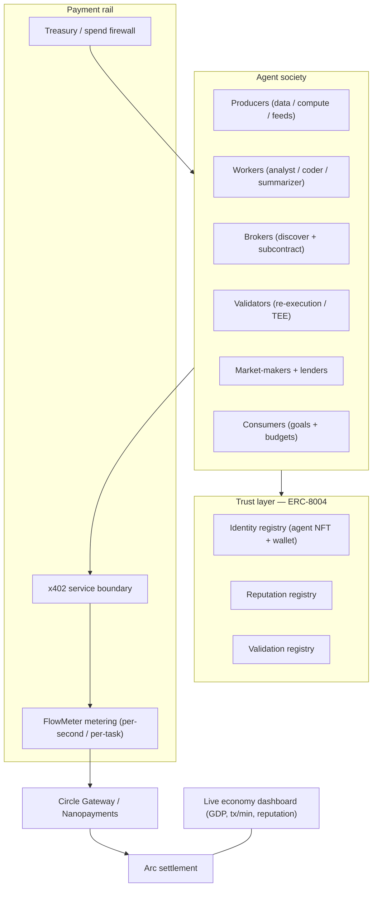
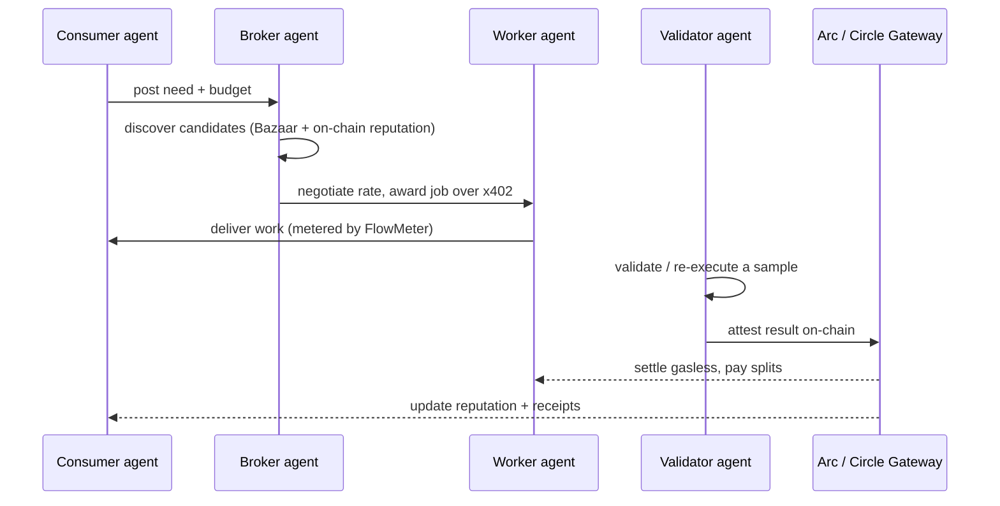

# Agora — The Self-Running Agent Economy on Arc (Master PRD / TDD)

> 🏛️ **The biggest version: don't build a payments demo — boot up an economy and let it run.** Agora is a
> self-sustaining society of autonomous AI agents that hire, pay, rate, and compete with each other 24/7,
> settling real USDC on Arc. The agents generate the traction themselves, so the whole thing runs on free
> testnet funds and open-source models — which is exactly why it beats your two constraints.
> **FlowMeter is its payment heart; ERC-8004 is its trust layer.**

**Internal references (not included here):** Research hub — *internal, no access* · Payment rail spec (FlowMeter) — *internal, no access*.
External references are listed inline and in [Tech stack](#tech-stack-on-a-budget).

---

## Why this is the biggest swing — and why it fits *your* constraints

You said the only blockers are **money** and **big integrations**. Read carefully, that rules the live-media,
paid-compute, and enterprise directions *out*, and points to one specific shape *in*: an economy where the
**agents are both the supply and the demand**, so volume is manufactured by the system itself.

- **No money needed.** Test-USDC is free from the Arc faucet; agents run on free or open-source models and
  frameworks; no GPUs, no paid data, no ad spend. The "traction" that kills most teams becomes free and
  effectively infinite.
- **No big integrations needed.** Agora is a closed, self-contained economy you fully control — you build the
  agents on both sides. External hooks (the x402 Bazaar, real APIs) are optional bonuses, not dependencies.
- **Highest ceiling on the rubric.** A living economy is simultaneously the most credible Traction story, the
  deepest Agentic story, and a genuine research result for Innovation.

---

## What Agora actually is

A persistent world where dozens-to-hundreds of autonomous agents each have:

- an **on-chain identity and wallet** (AgentKit + ERC-8004 Identity Registry),
- a **role** they earn money in (data producer, analyst, summarizer, coder, broker, validator, market-maker, lender, consumer),
- a **reputation** that is real, on-chain, and slashable (ERC-8004 Reputation + Validation registries),
- a **budget governed by a treasury and spend-firewall** (your Agent Arena / NightDesk edge).

They transact continuously: discovering needs, negotiating prices, hiring each other over x402, paying
per-task or per-second through FlowMeter, delivering work, rating outcomes, and reinvesting earnings. The
result is an emergent micro-economy with a measurable **GDP** — running while you sleep.

---

## How it maxes every judging axis

| Axis | Weight | How Agora maxes it |
| --- | --- | --- |
| **Agentic** | 30% | Agents autonomously discover, negotiate, hire, deliver, pay, rate, specialize, and self-govern budgets — plus emergent multi-agent behavior. This is the textbook "full autonomy" judges reward, not AI-flavored automation. |
| **Traction** | 30% | A 24/7 economy generates thousands of real on-chain USDC transactions with zero humans and zero spend — the most credible, and cheapest, volume any team can show. This is the criterion that kills most teams, turned into a strength. |
| **Circle use** | 20% | The entire stack at scale: a Wallet per agent, Gateway / Nanopayments for micro-settlement, Contracts for escrow / splits / reputation bonds / slashing, x402 at every service boundary, App Kit for treasury and FX, plus the x402 Bazaar for discovery. |
| **Innovation** | 20% | An emergent *economic* agent society settling real value on-chain — prior art (Stanford's Smallville) was *social*, not economic — combined with reputation-as-collateral and proof-of-flow metering. New, publishable research territory. |

---

## Architecture



---

## The agent society — roles

| Role | What it does | Earns by | Circle primitive |
| --- | --- | --- | --- |
| **Producers** | Sell continuous data feeds, compute, or generated content | Per-second FlowMeter streams | Nanopayments |
| **Workers** | Analysts, coders, summarizers that complete discrete tasks | Per-task x402 jobs | x402 + Contracts |
| **Brokers** | Discover needs, find candidates, subcontract and route work | Spread / routing fee | x402 Bazaar |
| **Validators** | Re-execute or attest a sample of work to confirm quality | Validation fees + slashed bonds | Contracts (ERC-8004 Validation) |
| **Market-makers / lenders** | Price discovery; lend USDC against reputation | Spread / interest | Contracts |
| **Consumers** | Demand agents with goals and budgets that buy work to hit them | (spend side) | Wallets + treasury |
| **Treasury / CFO** | Fail-closed budgets, rate caps, anomaly cutoff for every agent | Keeps the economy solvent | Wallets policy (your edge) |

---

## The economic loop — one job, end to end



---

## The trust layer — why the economy doesn't collapse

An open economy of anonymous agents only works if cheating is punished automatically. Agora stacks three defenses:

- **ERC-8004 registries.** Identity (an ERC-721 agent passport linked to a wallet and capabilities), Reputation
  (verifiable feedback signals), and Validation (stake-secured re-execution, zkML, or TEE oracles). This is the
  standard purpose-built for trustless agent economies.
- **Reputation-as-collateral.** Agents post a USDC bond; fraud or under-delivery slashes it. Trust becomes
  economically expensive to fake.
- **Proof-of-flow + treasury firewall (FlowMeter).** Pay only for delivered work; a fail-closed spend firewall
  means a buggy or hijacked agent physically cannot drain the economy.

---

## FlowMeter is the payment heart

Agora is the economy; **FlowMeter** *(internal payment-rail spec)* is the rail it runs on. Every per-second
stream (a producer selling a live feed) and every metered task settles through FlowMeter's **rate-authorization**,
**proof-of-flow receipts**, and **batched Gateway settlement**. Nothing from the FlowMeter spec is wasted — it
becomes the settlement primitive of a living economy instead of a standalone demo.

---

## The research story — emergent economic behavior

The Innovation differentiator: instrument the world and study what *emerges* when agents can earn and spend real
money and carry real reputation. Expect **specialization, price discovery, reputation premiums, undercutting and
cartels, boom-and-bust, and credit markets**. Stanford's generative-agent work showed believable *social*
behavior; Agora is the first to show *economic* behavior settling real on-chain value. Write it up — a short
research note plus a public dashboard is a genuine, citable result that almost no hackathon team can match.

---

## Full feature list

| Feature | Tier | What it does | Circle / Arc primitive | Cheap? |
| --- | --- | --- | --- | --- |
| Agent identity + wallet | **MVP** | Every agent gets an on-chain passport and wallet via AgentKit + ERC-8004 Identity | Wallets | Free |
| x402 service endpoints | **MVP** | Each agent exposes its services behind HTTP 402 so others can pay to use them | x402 | Free |
| Metered settlement | **MVP** | Per-task and per-second payment through FlowMeter, batched and gasless | Nanopayments / Gateway | Free (testnet) |
| Job / market loop | **MVP** | Post a need, hire, deliver, pay — the core economic transaction | Contracts | Free |
| On-chain reputation | **MVP** | Outcomes update each agent's verifiable track record | Contracts (ERC-8004 Reputation) | Free |
| Treasury / spend firewall | **MVP** | Per-agent budgets, rate caps, dead-man timeout, anomaly cutoff | Wallets policy | Free (your edge) |
| Live economy dashboard | **MVP** | GDP, transactions per minute, reputation leaderboard, specialization map | App Kit / chain reads | Free |
| Stake-secured validators | **Moat** | Validator agents re-execute a sample and attest quality on-chain | Contracts (ERC-8004 Validation) | Free |
| Reputation-as-collateral | **Moat** | USDC bonds posted and slashed on fraud or under-delivery | Contracts | Free |
| Proof-of-flow metering | **Moat** | Consumer-signed receipts so the meter advances only on delivered work | Contracts | Free |
| Emergence analytics | **Moat** | Instrument and visualize emergent economic behavior — the research result | Chain reads | Free |
| Broker / router agents | **Moat** | Agents that discover and subcontract work, creating a supply chain | x402 Bazaar | Free |
| Open to external agents | **Stretch** | List Agora services on the x402 Bazaar so other teams' agents join and pay | x402 Bazaar | Free |
| Agent credit market | **Stretch** | USDC loans against reputation; interest and default handling | Contracts | Low |
| TEE-attested metering | **Stretch** | Proof-of-flow v2 inside a trusted execution environment | Validation oracle | Low |
| Mainnet beta + FX | **Stretch** | Real-value beta with USDC / EURC conversion for payouts | App Kit | Low |

---

## Tech stack on a budget

Everything below has a free tier or is open-source, which is the whole point.

- **Agent wallets + onchain actions:** Coinbase AgentKit — "every AI agent deserves a wallet," framework-agnostic, fee-free stablecoin payments. → https://github.com/coinbase/agentkit
- **Payment boundary:** x402 docs • x402 whitepaper • seller quickstart (`upto` scheme) • x402 V2 batch settlement.
- **Discovery:** x402 Bazaar — a ready-made "search engine for agents," so you don't build discovery from scratch.
- **Trust layer:** ERC-8004 spec (https://eips.ethereum.org/EIPS/eip-8004) • ERC-8004 reference contracts (https://github.com/erc-8004/erc-8004-contracts) — Identity, Reputation, Validation registries.
- **Settlement + chain:** Circle Gateway / Nanopayments (https://www.circle.com/nanopayments) • Arc docs (https://docs.arc.io) • arc-nanopayments reference (https://github.com/circlefin/arc-nanopayments) • Arc faucet (https://faucet.circle.com — free test USDC).
- **Agent brains (cheap):** open-source frameworks like **LangGraph, CrewAI** (free tier), or **n8n**, paired with open-source LLMs. Most actors can be **rule-based**; only a few need a paid model.
- **Prior art / research:** Generative Agents (Stanford, arXiv 2304.03442) — the social-simulation lineage Agora extends into economics.
- **Payment rail:** FlowMeter *(internal spec)*.

---

## 6-month roadmap (mapped to the FlowMeter phases)

- **Month 1 — Boot it.** A 5-agent economy MVP: wallets, x402 endpoints, FlowMeter settlement, a job loop, and a live dashboard. First autonomous USDC changing hands.
- **Month 2 — Scale + standardize.** Provider/consumer SDKs, publish the draft stream standard, grow to dozens of agents and roles.
- **Month 3 — Trust it.** ERC-8004 Identity + Reputation + Validation; reputation-as-collateral with bonds and slashing.
- **Month 4 — Harden it.** Validator agents, treasury/firewall product, proof-of-flow v2 (TEE), emergence analytics.
- **Month 5 — Open it.** List on the x402 Bazaar so external teams' agents join; scale volume; mainnet beta; App Kit FX.
- **Month 6 — Prove it.** Publish the emergent-economy research note, submit the stream scheme to the x402 Foundation, polish the final submission.

---

## Demo script (under 3 minutes)

1. **0:00–0:25 — Hook.** "This isn't a payments demo. It's an economy. It's been running by itself all night."
2. **0:25–1:10 — The living dashboard.** Show GDP ticking up, transactions per minute, a reputation leaderboard, agents specializing.
3. **1:10–1:50 — One job, end to end.** Zoom into a consumer posting a need, a broker hiring a worker over x402, FlowMeter metering delivery, a validator attesting, settlement and reputation update.
4. **1:50–2:25 — Trust under fire.** Inject a fraudulent agent; show its bond slashed and reputation tank automatically.
5. **2:25–3:00 — Scale + vision.** Show the cumulative on-chain volume counter and close: "the self-running economy for the machine age, on Arc."

---

## Risks, honestly

- **LLM cost at scale.** Use cheap or free models and make most agents rule-based; only a few "smart" roles need a paid model. Caps keep spend bounded.
- **Wash-trading inflates fake volume.** Reputation bonds + validators + honest reporting of genuine versus internal volume. Don't overclaim — judges reward honesty.
- **Emergence is unpredictable.** Seed roles and incentives; treat surprises as findings, not failures — that is the research.
- **Faucet limits.** Batch settlement and provision wallets early so demo volume is never faucet-bottlenecked.

---

## Competitive / prior art

| Project | What it is | Gap Agora exploits |
| --- | --- | --- |
| Stanford Smallville / Generative Agents | Simulated agent society with believable social behavior | Social only — no real money, no on-chain economy or reputation |
| x402 Bazaar | Discovery layer / search engine for paid agent services | A directory, not an economy; Agora consumes it rather than competing |
| Coinbase AgentKit | Gives agents wallets and onchain actions | A toolkit, not a running economy; Agora is built on top |
| t54.ai and similar | Trust / infrastructure layers for agent payments | Infrastructure, not a populated, self-sustaining economy with emergent behavior |
| Sablier / Superfluid | Fixed-rate token streaming | No delivery proof, no usage metering, not agent-economy-native |

---

## Submission package

- [ ] Public GitHub repo (economy engine + agent roles + ERC-8004 integration + FlowMeter rail + dashboard)
- [ ] Sub-3-minute demo video built around the live dashboard
- [ ] Live hosted link to the running economy + dashboard
- [ ] README with architecture diagram and every Circle / Arc primitive used
- [ ] Short research note on the emergent economic behavior observed
- [ ] Submitted via the official form

---

## Build trackers

Reuse the **FlowMeter** databases for the rail, and the FlowMeter 6-month roadmap for sequencing. Agora-specific
feature rows can be tracked in the feature table above or promoted into a database on request.

---
---

# Appendix A — Verified technical reference (added 2026-05-29)

> Concrete, build-ready facts verified against `docs.arc.io` + Circle docs during planning. The PRD above is the
> product spec; this appendix is the engineering ground truth so the team can start day one without re-deriving it.

## A.1 Arc Testnet — network config
| Item | Value |
| --- | --- |
| Network | **Arc Testnet** (mainnet for institutions: **Summer 2026**) |
| Chain ID | `5042002` |
| Native gas token | **USDC** (18 decimals) — no separate gas token |
| RPC (HTTP) | `https://rpc.testnet.arc.network` (also Blockdaemon / dRPC / QuickNode variants) |
| RPC (WS) | `wss://rpc.testnet.arc.network` |
| Explorer | `https://testnet.arcscan.app` |
| Faucet | `https://faucet.circle.com` (free test USDC) |
| USDC (testnet) | `0x3600000000000000000000000000000000000000` |
| ERC-8183 ref contract (testnet) | `0x0747EEf0706327138c69792bF28Cd525089e4583` |
| Consensus / execution | Malachite Tendermint BFT consensus · **Reth** (Rust) execution client |
| Contract language | **Solidity / EVM** (Foundry / Hardhat / Viem). ⚠️ NOT Stylus/Rust — Stylus is an Arbitrum tech, not Arc. |

## A.2 What's LIVE on Arc testnet today (all MVP primitives are shippable now)
- ✅ **Circle Nanopayments** — gasless USDC down to `$0.000001`, live on Arc testnet (~Feb 2026). Reference sample: `github.com/circlefin/arc-nanopayments`.
- ✅ **x402** — "402 Payment Required → USDC" pay flow via Circle Gateway. Circle pattern: "turn your API into a storefront for agents."
- ✅ **ERC-8004** — Identity + Reputation + Validation registries live on Arc testnet (Circle promotes "reputation-gated agent marketplaces with ERC-8004 identity + USDC escrow + Nanopayments"). Spec: EIP-8004; contracts: `github.com/erc-8004/erc-8004-contracts`.
- ✅ **ERC-8183 jobs** — createJob → fund escrow (USDC) → submit → evaluate → settle. Tutorial + Arc Escrow sample app exist.
- ✅ **USDC settlement** — native.
- ⚠️ **Privacy (opt-in, TEE-based)** — ROADMAP, **not live**. Affects the "TEE-attested metering" stretch feature — don't depend on it for the hackathon.

## A.3 AgentKit on Arc (integration note)
Coinbase AgentKit supports any EVM chain via **`ViemWalletProvider`** or **`EthAccountWalletProvider`** (local
private key) configured with Arc's RPC + chain ID `5042002`. The deep **CDP-native** wallet features are
Base-tuned, so wire Agora agent wallets through the Viem/local-key provider, not the CDP server wallet. Minor
integration task, not a blocker. (npm: `@coinbase/agentkit`; PyPI: `coinbase-agentkit`.)

## A.4 Recommended hackathon MVP cut (build the demo, not the empire)
The 6-month roadmap is the full vision; for a hackathon submission, build **only** the Month-1 MVP + the two
highest-impact "Moat" beats, scoped to the 3-minute demo:
1. **3–5 agents**, one clean loop: Consumer posts need+budget → Broker hires Worker (x402) → FlowMeter meters delivery → Validator attests → Nanopayments settles → ERC-8004 reputation updates.
2. **A beautiful live dashboard** (GDP, tx/min, reputation leaderboard) — this is the "wow."
3. **The fraud-slash beat** — inject a cheating agent, show its USDC bond auto-slashed + reputation tank. (Money shot.)
4. **Hedge the Traction axis:** get a sliver of *real external* volume (list 1–2 services on the x402 Bazaar so outside agents pay yours), and report genuine-vs-internal volume honestly.
Everything else (lenders, credit markets, TEE metering, FX, SDKs, research paper) = "future work" slide.

## A.5 Suggested repo structure (starting point)
```
agora/
├─ contracts/            # Solidity: escrow/splits, reputation bonds + slashing (or use ERC-8004/8183 refs)
│  └─ foundry.toml
├─ agents/               # agent roles (producer, worker, broker, validator, consumer, treasury)
│  ├─ shared/            # wallet (Viem provider), x402 client/server, FlowMeter client, ERC-8004 client
│  └─ roles/
├─ rail/                 # FlowMeter: rate-authorization, proof-of-flow receipts, batched Gateway settlement
├─ orchestrator/         # the world loop that ticks the economy 24/7
├─ dashboard/            # live economy UI (GDP, tx/min, reputation leaderboard) — App Kit / chain reads
├─ docs/                 # this tdd.md, architecture diagram, research note
└─ README.md             # architecture + every Circle/Arc primitive used (submission requirement)
```
> Note: `circle-agent/` (already cloned in this repo) is a TypeScript x402/Circle-nanopayments demo — review it
> as a reference starting point for the agent ↔ x402 ↔ settlement wiring.
